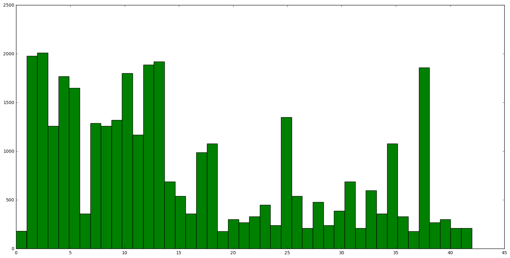

# **Traffic Sign Recognition**


**Build a Traffic Sign Recognition Project**

The goals / steps of this project are the following:
* Load the data set (see below for links to the project data set)
* Explore, summarize and visualize the data set
* Design, train and test a model architecture
* Use the model to make predictions on new images
* Analyze the softmax probabilities of the new images
* Summarize the results with a written report


### Data Set Summary & Exploration

#### 1. Provide a basic summary of the data set.

I used the `numpy` library to calculate summary statistics of the traffic signs data set:

```python
# Number of training examples
n_train = X_train.shape[0]
# => 34799

# Number of validation examples
n_validation = X_valid.shape[0]
# => 4410

# Number of testing examples.
n_test = X_test.shape[0]
# => 12630

# What's the shape of an traffic sign image?
image_shape = X_train[0].shape
# => (32, 32, 3)

# How many unique classes/labels there are in the dataset.
n_classes = np.unique(y_train).shape[0]
# => 43
```

#### 2. Include an exploratory visualization of the dataset.

Here are some sample images from the dataset as well as a histogram depicting the distribution
of labels in the set.




### Design and Test a Model Architecture

#### 1. Describe how you preprocessed the image data. What techniques were chosen and why did you choose these techniques?
To preprocess my images, I grayscaled the images and normalized them. I chose to grayscale the images to
reducer the number of channels (which makes training a bit faster) and mainly because the color channel is not
vitally important in being able to classify an image. A stop sign in RGB color space is still a stop sign in
gray-space. Normalizing the distribution of features from [-1, 1] centers the data around zero mean to allow our weights to be trained within a much tighter distribution. Otherwise, outliers in our data could adversely affects the training of our weights. Here is our sample dataset but now grayscaled and normalized.


#### 2. Describe what your final model architecture looks like including model type, layers, layer sizes, connectivity, etc.) Consider including a diagram and/or table describing the final model.

My final model consisted of the following layers:

| Layer             |     Description                   | Input | Output
|:---------------------:|:---------------------------------------------:|
| Input                 | 32x32x1 image                 | 30x30x1 | 30x30x1
| Convolution 3x3 -> Batch Norm -> ReLU  | 1x1 stride, valid padding  | 30x30x1 | 30x30x16
| Convolution 3x3 -> Batch Norm -> ReLU  | 1x1 stride, same padding  | 30x30x16 | 30x30x64
| Convolution 3x3 -> Batch Norm      | 1x1 stride, same padding  | 30x30x64| 30x30x64
| Convolution 3x3 -> Batch Norm      | 1x1 stride, valid padding  | 30x30x1| 30x30x64
| Add Layers -> Batch Norm -> ReLU     | Add Input and Previous Layer  | 30x30x64| 30x30x64
| Max Pooling     | 2x2 kernel, 2x2 stride, valid padding  | 30x30x64| 15x15x64
| Convolution 5x5 -> Batch Norm -> ReLU  | 1x1 stride, valid padding  | 15x15x64 | 11x11x128
| Convolution 5x5 -> Batch Norm -> ReLU  | 1x1 stride, same padding  | 11x11x128 | 11x11x128
| Convolution 5x5 -> Batch Norm      | 1x1 stride, same padding  | 11x11x128| 1x11x128
| Convolution 5x5 -> Batch Norm      | 1x1 stride, valid padding  | 11x11x128| 11x11x128
| Add Layers -> Batch Norm -> ReLU     | Add Input and Previous Layer  | 11x11x128| 1x11x128
| Max Pooling     | 2x2 kernel, 2x2 stride, valid padding  |11x11x128| 5x5x128
| Convolution 5x5 -> Batch Norm -> ReLU  | 1x1 stride, valid padding  | 5x5x128 | 1x1x128
| Convolution 5x5 -> Batch Norm -> ReLU  | 1x1 stride, valid padding  | 1x1x128 | 1x1x400
| Flatten | Flatten Layer into 1D tensor | 1x1x400 | 400
| Fully Connected Layer | Standard FC  layer| 400 | 128
| Fully Connected Layer | Standard FC  layer | 128 | 512
| Output Layer | Softmax of 43 classes | 512 | 43
#### 3. Describe how you trained your model. The discussion can include the type of optimizer, the batch size, number of epochs and any hyperparameters such as learning rate.

To train the model, I used an Amazon EC2 `g2.2xlarge` instance to train the model. I have left the optimizer as Adam from the lesson's LeNet implementation and used a batch size of 128 with a learning rate of 0.001 for 20 epochs.

#### 4. Describe the approach taken for finding a solution and getting the validation set accuracy to be at least 0.93. Include in the discussion the results on the training, validation and test sets and where in the code these were calculated. Your approach may have been an iterative process, in which case, outline the steps you took to get to the final solution and why you chose those steps. Perhaps your solution involved an already well known implementation or architecture. In this case, discuss why you think the architecture is suitable for the current problem.

My final model results were:
* training set accuracy of 99.8%
* validation set accuracy of 98.9%
* test set accuracy of 95.8%

Right off the bat, I tried to implement the LeNet model from the lesson but for some reason I was getting only getting about 70% accuracy on the validation set even though some other students were reporting much higher numbers. This took a very long to realize but the issue was that I was normalizing the data incorrectly which resulted in very bad training results. Moreover, I neglected to use the `mu` and `sigma` parameters to as arguments to `tf.truncated_normal` which also caused significant problems. As soon as I realized and corrected my errors, I was able to get the plain LeNet working as intended.

- My initial approaches consisted of just adding more convolutional layers and making the fully connected layers bigger. While that did show small performance gains, it was not enough to achieve the desired requirement.
- For the subsequent attempts, I decided to try out a smaller and modified version of the [ResNet](https://arxiv.org/abs/1512.03385) model architecture. I chose this architecture because it has performed well on other image classification tasks and allows the construction of deeper networks without hurting performance as compared to a standard deep neural network. The way that the ResNet architecture achieves this is by using so-called shortcut blocks which are convolutional layers two or three layers from the past. In a sense, this allows the network to maintain a big picture of the network has already seen in the past.
- After the skeleton of the network was implemented, the rest of the time was spent tuning hyperparameters. I tried increasing the number of convolutional 3x3 blocks from two to three, but this did not show any positive sign of improvements. Eventually, after trying out different strides, filters, layers and arrangements, I settled on the model that I currently have.


### Test a Model on New Images

#### 1. Choose five German traffic signs found on the web and provide them in the report. For each image, discuss what quality or qualities might be difficult to classify.

Here are five German traffic signs that I found on the web:


I think all of these images should be fairly easy to classify since most of them actually somewhat resemble something that the network has trained on before.

#### 2. Discuss the model's predictions on these new traffic signs and compare the results to predicting on the test set. At a minimum, discuss what the predictions were, the accuracy on these new predictions, and compare the accuracy to the accuracy on the test set.

Here are the results of the prediction:

| Image             |     Prediction                    |
|:---------------------:|:---------------------------------------------:|
| Keep Right         | Keep Right                  |
| Yield            | Yield                   |
| No Entry             | No Entry                     |
| Children Crossing          | Children Crossing                  |
| 60 km/h sign     | Keep Right


The model was able to correctly guess 5 of the 6 traffic signs, which gives an accuracy of 83.33%. This was very surprising because the model completely flopped on the last image of the 60 km/h sign.
It was 78% confident that it was a `Go straight or right` sign which is evidently not the case. The accuracy on this set was lower than the 95.8% accuracy on the test set.

#### 3. Describe how certain the model is when predicting on each of the five new images by looking at the softmax probabilities for each prediction. Provide the top 5 softmax probabilities for each image along with the sign type of each probability.


For the first image, the model is relatively sure that this is a keep right sign (probability of 1.0), and the image does contain a a keep right sign. The top five soft max probabilities were

| Probability           |     Prediction                    |
|:---------------------:|:---------------------------------------------:|
| 1.0                   | Keep Right                  |
| 0.                    | Speed limit (30km/h)                    |
| 0.                    | Speed limit (20km/h)                 |
| 0.                    | Road work                |
| 0.                    | Roundabout Mandatory                |
